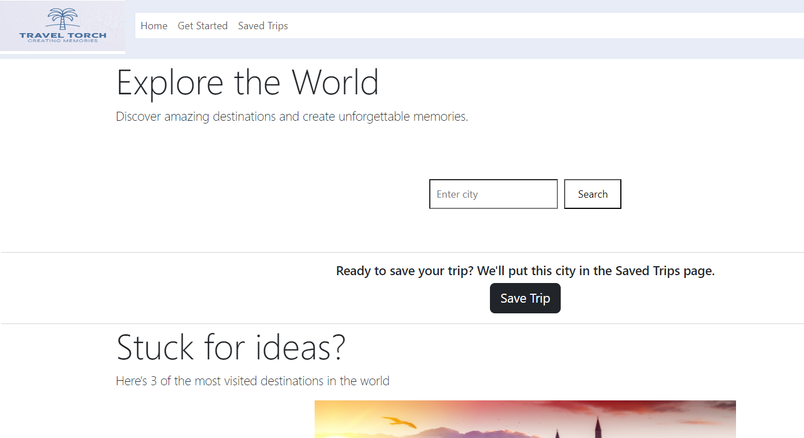

# Weather & Attractions App

Welcome to the Weather & Attractions App! This is a comprehensive tool designed to assist travellers and enthusiasts alike. Whether you're planning a trip or just curious about the weather and top attractions in a particular city, our app has got you covered.

## 🌟 Features

### Dynamic Weather Data:

Get real-time weather information for any city worldwide.
Access a detailed 5-day forecast to help plan your week ahead.
Discover Top Attractions:

Explore the must-visit spots in your chosen city.
View images sourced from Unsplash to get a visual feel of each attraction.

### Responsive & Sleek Design: 

Crafted with Bootstrap, ensuring a seamless experience across devices.
Intuitive user interface with event listeners for a smooth user journey.

## 🌐 APIs Utilised

### OpenWeather API: 

Powers the fetching of current weather details and 5-day forecasts.
### Here API: 

Responsible for geocoding city names and retrieving top attractions.

### Unsplash API: 

Provides high-quality images corresponding to the top attractions.

## 🔗 Important Links

### Live App: 

Access the Live Application [here](https://bh1ff.github.io/Travel-Torch/).

### Repository: 

Visit the GitHub Repo [here](https://github.com/bh1ff/Travel-Torch).

## 👥 Collaborators & Contributors
Meet the team behind this project:

* [Michael](https://github.com/michaelfame)
* [Umhar](https://github.com/Umhar97)
* [Bh1ff](https://github.com/bh1ff)

## 🚀 Getting Started
If you're interested in setting up the project locally or contributing, follow these steps:

``` 

git clone https://github.com/bh1ff/Travel-Torch

cd Travel-Torch

```

Alternatively, you can use a live server to view the project.

## 💌 Feedback & Contributions
We value your feedback and contributions. For major changes or feature requests, please open an issue first to discuss your ideas. Bug reports, direct feedback, and pull requests are always welcome!

## 📜 License
This project is open source and available under the MIT License.

### Thank you for exploring the Weather & Attractions App. We're confident it will elevate your travel planning experience! Safe travels! 🌍✈️
=======
# Travel-Torch
Travel Torch: Your pocket-sized guide to global adventures.

## Overview

Travel Torch is a web application that allows users to search for cities and save them to a list of saved trips. The application is built using HTML, CSS, JavaScript, Bootstrap and some APIs.

## Location for Project storage
```
Git repo: https://github.com/bh1ff/Travel-Torch.git
Github Url: https://bh1ff.github.io/Travel-Torch/

## Featured technologies used to implement the project

* HTML5 - for building Markup pages
* Bootstrap
* Javascript using Jquery.
* Vscode
* Github
* APIs :- OpenWeatherMap API, Here API, Unsplash API.

## Usage

To use Travel Torch, simply enter the name of a city in the search bar and click the "Search" button. The application will then display information about the city, such as the weather, attractions, and events. You can also save the city to your list of saved trips by clicking the "Save Trip" button.

## Features

Travel Torch includes the following features:

* Search for cities by name
* View information about cities, such as the weather, attractions, and events
* Save cities to a list of saved trips
* View your saved trips

## Screenshots



## Contributors

Group 3 team in the Bootcamp, comprising of: Ahmed Ayad , Michael Famojuro and Umhar Hussain.

## License

Travel Torch is licensed under the MIT license.

```

